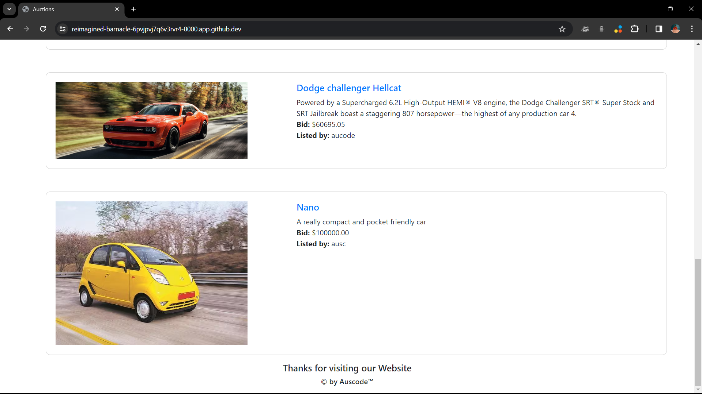
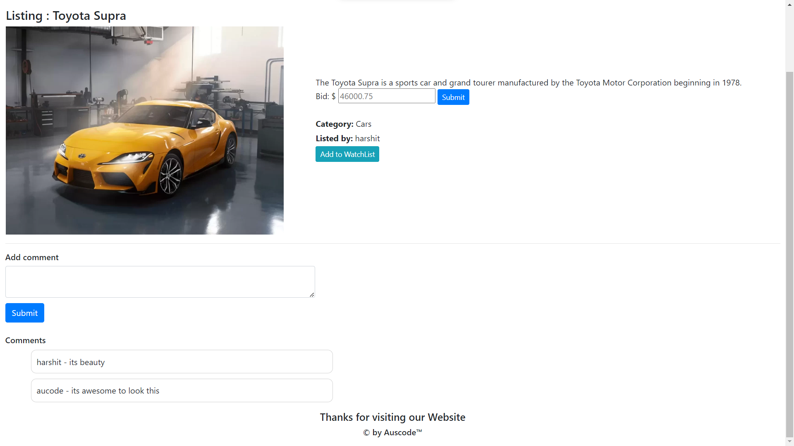

# Auction 
You can see working model on [YouTube](https://youtu.be/7wNcap6HS2k).

# Auction Platform

Welcome to the Auction Platform! This web application allows users to create and bid on listings, manage their watchlists, and interact with other users through comments.







## Table of Contents

- [Overview](#overview)
- [Installation](#installation)
- [Usage](#usage)
- [File Structure](#file-structure)
- [Contributing](#contributing)
- [License](#license)

## Overview

Provide a brief overview of your project.

## Installation

1. Clone the repository:

    ```bash
    git clone https://github.com/auscode/auction
    ```

2. Navigate to the project directory:

    ```bash
    cd auction
    ```

3. Install the required dependencies:

    ```bash
    pip install -r requirements.txt
    ```

4. Apply migrations:

    ```bash
    python manage.py migrate
    ```

## Usage

1. Run the development server:

    ```bash
    python manage.py runserver
    ```

2. Access the application in your web browser at [http://localhost:8000](http://localhost:8000).


## License

This project is licensed under the [MIT License](LICENSE).
